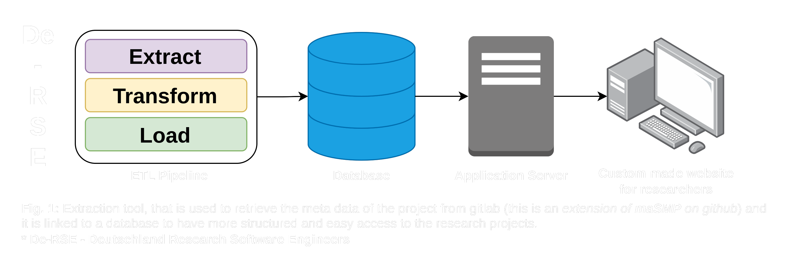

# Software Metadata Extraction (GitLab)

## Description 

The objecctive of this project is to develop a system that identifies the properties which are related to a specific schema, that is used create structure in the past, present, and upcoming research softwares to follow the FAIRness, that helps to organize all the research software for easy retrival of most relatable software to the give query. It is a tool which can be used as a plugin or an application.

## Objectives

- [ ] Extract–Transform–Load (**ETL**) Pipeline  
- [ ] Find the relevant information for metadata extraction from GitLab
  - Required properties (project API vs REST API)
  - Recommended properties
  - Optional
- [ ] PoC
  - [x] Required properties
  - [x] Recommended properties
  - [ ] Optional
  
- [ ] Actual task
   - [ ] simple plugin or UI (Note: NO ETL --> Use application to extract metadata from any platform (gitlab???).)
   - Read about SOMEF (already extracts metadata - ### no that great ###)
   
  	

---

### References

[1]: https://schema.org/docs/schemas.html  
[1] https://schema.org/docs/schemas.html
